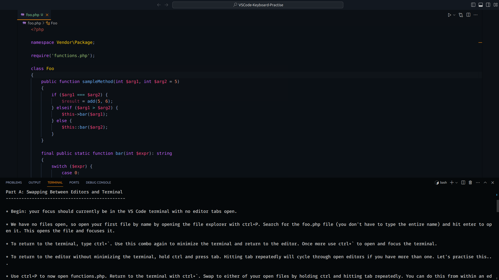

VS Code Keyboard Shortcut Practise
==================================

About
------

* Version 0.1.0.
* Created by Sherri Wheeler (SyntaxSeed.com).
* Some sample code copied from www.php-fig.org PSRs.
* Licence: GPLv3.

Description
------------

This repository contains follow along lessons to learn and practise keyboard navigation, keybindings and shortcuts for Visual Studio Code (VS Code). The code included is mostly nonsense, but used for the purposes of practise. This lesson uses PHP but the techniques apply to any language. Once you have the files and lesson open and ready, try to do the entire lesson without touching your mouse!

> "Everything we do is practice for something greater than where we currently are. Practice only makes for improvement."  - Les Brown

Lessons
--------

* Lesson 1: Navigating Files, the Terminal, and Search
* Lesson 2: (coming soon!)

Setup
------

* Open the directory containing this document in VS Code.
* Open the first lesson in the VS Code terminal (ctrl+` then cat lessons/lesson1.txt). Scroll to the top of the lesson.
* Some people may prefer to open the lesson in a separate window (for example on another monitor). If you do this, still open the VS Code terminal with ctrl+` before you start.
* Close any open editors (tabs in VS Code).
* Set aside your mouse and follow along.

* Note for Mac users: most commands are the same, but use the cmd key for ctrl.
